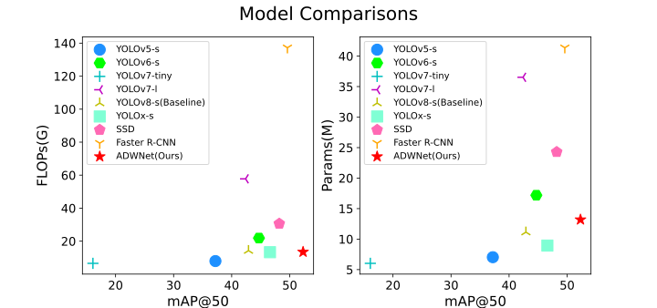

# 1. ADWNet

We mainly use MMDetection([GitHub - open-mmlab/mmdetection: OpenMMLab Detection Toolbox and Benchmark](https://github.com/open-mmlab/mmdetection)) and MMYOLO([GitHub - open-mmlab/mmyolo: OpenMMLab YOLO series toolbox and benchmark. Implemented RTMDet, RTMDet-Rotated,YOLOv5, YOLOv6, YOLOv7, YOLOv8,YOLOX, PPYOLOE, etc.](https://github.com/open-mmlab/mmyolo)) in openmmlab([OpenMMLab](https://openmmlab.com/)) to conduct experiments, which ensures the consistency of hardware conditions and software conditions for all experiments. Thanks to the OpenMMLab team for developing the project, it was very useful for the research and if you want to use it, please don't forget the contribution they made.

# 2. Environment

## 2.1 Preparation work

If you want to use our model, you need to go and install the mmyolo framework according to the official website and then learn to use the config file.

You should read the installation documentation in mmyolo, install conda, then create an environment and install the appropriate python version and pytorch version according to the documentation in MMYOLO.

|    Tools    |                            Links                             |
| :---------: | :----------------------------------------------------------: |
|    Conda    | [Conda :: Anaconda.org](https://anaconda.org/anaconda/conda) |
| MMDetection | [Welcome to MMDetection’s documentation! — MMDetection 3.2.0 documentation](https://mmdetection.readthedocs.io/en/latest/) |
|   MMYOLO    | [Welcome to MMYOLO’s documentation! — MMYOLO 0.6.0 documentation](https://mmyolo.readthedocs.io/en/latest/) |
|   Pytorch   |               [PyTorch](https://pytorch.org/)                |

## 2.2 Dataset

You can download the full dataset from this [link](https://infernolia.github.io/WEDGE/).

# 3. Experiment 

## 3.1 EMA module

You can find a specific explanation of the EMA module at this [link](modules/EMA.py).

## 3.2 RepGDNeck

You can find RepGDNeck at this [link](modules/RepGDNeck.py).

## 3.3 Configs 

### 3.3.1 Ablation stduies

| model           | Config files                                                 |
| --------------- | ------------------------------------------------------------ |
| Baseline        | [Baseline](Configs/Ablation_experiment/yolov8_s_1xb4-100e_ADW.py) |
| +EMA            | [+EMA](./Configs/Ablation_experiment/yolov8_s_1xb4-100e_ADW_EMA.py) |
| +RepGDNeck      | [+RepGDNeck](Configs/Ablation_experiment/yolov8_s_1xb4-100e_ADW_RepGDNeck.py) |
| +SIoU           | [+SIoU](Configs/Ablation_experiment/yolov8_s_1xb4-100e_ADW_SIOU.py) |
| +EMA+RepGDNeck  | [+EMA+RepGDNeck](Configs/Ablation_experiment/yolov8_s_1xb4-100e_ADW_EMA_RepGDNeck.py) |
| +EMA+SIoU       | [+EMA+SIoU](Configs/Ablation_experiment/yolov8_s_1xb4-100e_ADW_EMA_SIOU.py) |
| +RepGDNeck+SIoU | [+RepGDNeck+SIoU](Configs/Ablation_experiment/yolov8_s_1xb4-100e_ADW_RepGDNeck_SIOU.py) |
| **ADWNet**      | [ADWNet](Configs/Ablation_experiment/ADWNet(ours).py)        |

### 3.3.2 Comparison experiment

| **Model**    | Config files                                                 |
| ------------ | ------------------------------------------------------------ |
| YOLOv5-s     | [YOLOv5-s](Configs/Comparison_experiment/yolov5_s-v61_1xb4-100e_ADW.py) |
| YOLOv6-s     | [YOLOv6-s](Configs/Comparison_experiment/yolov6_s_1xb4-100e_ADW.py) |
| YOLOv7-tiny  | [YOLOv7-tiny](Configs/Comparison_experiment/yolov7_tiny_1xb4-100e_ADW.py) |
| YOLOv7-l     | [YOLOv7-l](Configs/Comparison_experiment/yolov7_l_1xb4-100e_ADW.py) |
| YOLOX-s      | [YOLOX-s](Configs/Comparison_experiment/yolox_s_1xb4-100e-rtmdet-hyp_ADW.py) |
| SSD          | [SSD](Configs/Comparison_experiment/ssd_1xb4_100e_ADW.py)    |
| Faster R-CNN | [Faster-RCNN](Configs/Comparison_experiment/faster_rcnn_r50_fpn_1xb4_100e_ADW.py) |
| **ADWNet**   | [ADWNet](Configs/Comparison_experiment/ADWNet(ours).py)      |

